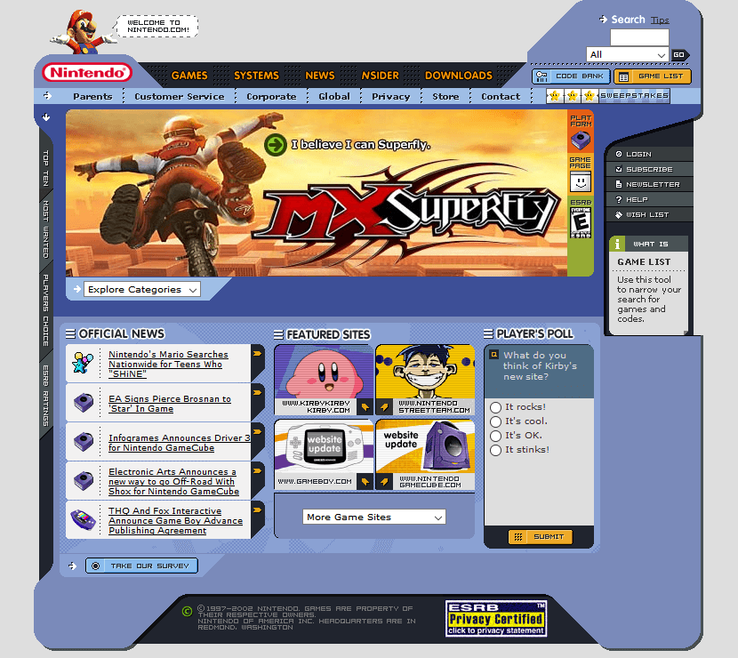
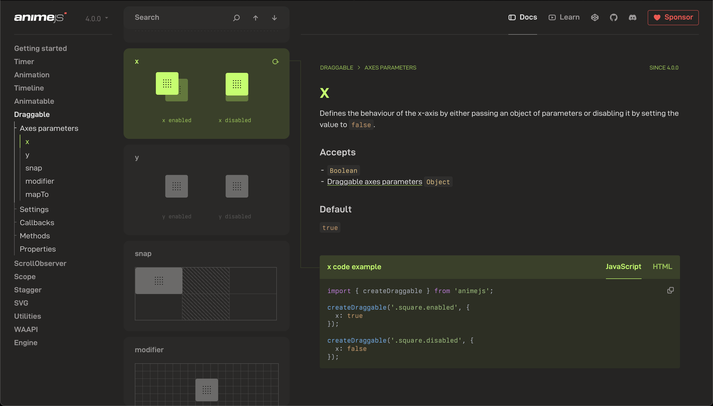

# CSS in the Age of Tailwind

<br />

Consider for a moment the following code, which was recently featured on the CodePen newsletter:

<br />

<p class="codepen" data-height="300" data-theme-id="dark" data-default-tab="html,result" data-slug-hash="XJWLdjZ" data-pen-title="Sticker filter" data-editable="true" data-user="kevin-carlos-grajeda-a" style="height: 300px; box-sizing: border-box; display: flex; align-items: center; justify-content: center; border: 2px solid; margin: 1em 0; padding: 1em;">
  <span>See the Pen <a href="https://codepen.io/kevin-carlos-grajeda-a/pen/XJWLdjZ">
  Sticker filter</a> by Kevin Grajeda (<a href="https://codepen.io/kevin-carlos-grajeda-a">@kevin-carlos-grajeda-a</a>)
  on <a href="https://codepen.io">CodePen</a>.</span>
</p>
<script async src="https://public.codepenassets.com/embed/index.js"></script>


<br/>

It's cool. *Very* cool. In fact, it seems so unique in a way, like a picture that you saw a long time which is now only a vague mental image.

<br/>

It's easy to forget that CSS and HTML are so powerful. CSS alone is one of the greatest achievements of the web. Thousands of "centering divs is hard" memes would make you think otherwise, but really... it's incredible. Breathtaking. 

<br/>

Every once in a while, you see something that strikes you and shakes you from your bubble for a minute. You end up asking the question: *"Why don't I see more websites that are doing unique things like this?"*

<br/>
<br/>

## A Quick Comparison
Look over a couple of pages, and tell me which one is more interesting to you:

<br/>



<br/>


<br/>

These are two screenshots of the Nintendo.com homepage, one from 2002 and one from 2025. What Nintendo's site looks like now is not surprising. In fact, it's quite normal. Almost *too* normal. Hyper-average. As a user, I would most likely have no trouble scrolling around or logging into my account...

**but**...

<br/>

*Is it fun?* Not really. 

*Interesting?* No. 

*Unique?* Quite the opposite.

<br/>
<br/>

## The Forgotten Art of Web Design

In the age of Tailwind and ShadCN, part of the **magic** of web development feels lost. Most times you'll visit web pages to see identical, tired designs over and over, never venturing outside of basic structures and shapes. 

<br/>

Perhaps part of the blame lies in the lack of experimentation that a framework brings--[Tailwind has just one mention of custom filters](https://tailwindcss.com/docs/filter#using-a-custom-value) and doesn't even provide an example. But that's not the fault of Tailwind, it was just filling a need. A general starting point. 

<br/>

The real cause of this ["enshitification"](https://en.wikipedia.org/wiki/Enshittification) of web design is that businesses don't see value in designing bespoke pages.

<br/>

 The basics work, and it's what users expect. **We have traded creativity and art in order to make things easier**--and I propose that we are worse off for it.

<br/>

Let's look at the CodePen example for a minute. It's achieved with an HTML feature that has been supported since **version 5 of Chrome, in 2010** ([not kidding, look it up](https://developer.mozilla.org/en-US/docs/Web/SVG/Reference/Element/filter#see_also)), the humble svg `<filter>`. With these, we can implement an "effects chain" on an original image or even generate filter data. With it, we are able to set up a a group of filers, using their `result` to wire them together. 

<br/>

```html
<feTurbulence type="fractalNoise" baseFrequency="0.02" numOctaves="1" seed="14" stitchTiles="noStitch" result="feTurbulence-5a5b7d7d"></feTurbulence>
<feColorMatrix in="feTurbulence-5a5b7d7d" type="saturate" values="30" result="feColorMatrix-d8c90d8d"></feColorMatrix>
```
Combining these two together would give us a colorful noise map that we can then apply to whatever we wish.

<br>
<br>

<svg xmlns="http://www.w3.org/2000/svg" width="0" height="0">
  <defs>
    <filter id="sticker">
    <feTurbulence type="fractalNoise" baseFrequency="0.02" numOctaves="1" seed="14" stitchTiles="noStitch" result="feTurbulence-5a5b7d7d"></feTurbulence>
<feColorMatrix in="feTurbulence-5a5b7d7d" type="saturate" values="30" result="feColorMatrix-d8c90d8d"></feColorMatrix>
    </filter>
  </defs>
</svg>


<div style="filter: url(#sticker); height: 100px; max-width:75%; margin: 0px auto;">
</div>

<br/>

Now, *is this useful?* No, not by itself on first glance. But the possibilities from here are endless, and the constraints of Tailwind or other frameworks have knee-caped this kind of experimentation.

<br/>
<br/>

## Back To Nintendo
Now, is Nintendo *using* these fancy filters? No--they weren't invented yet. But look at their site and imagine what should be possible in the modern age with all of the tools we have at our disposal. I'll encourage you to [go and visit the 2002 site on the WayBackMachine](https://web.archive.org/web/20020802092327/http://www.nintendo.com:80/index.jsp) and inspect the page yourself. Tables inside of tables inside of tables with CSS powering the whole thing. 

<br/>

The web design/dev world has become too afraid of breaking out of the "normal" box. We fear that unless our site looks like all the other sites on the web, users will get lost or leave; to prevent this, we have slowly sucked the life out of the web we have today. "Don't experiment, don't try something new--just stick to the script."

<hr/>

*And just to beat the criticism, I know my own site here isn't groundbreaking design-wise either. But in my limited time, I at least wrote the entire thing from scratch instead of starting with the same generic portfolio template I see so often from job applicants.*

<hr/>

I think that there's real benefit to devs exploring more of the creative art of CSS again and moving away from pill buttons and card shapes. There's a big, open world of ideas to explore and play with, just begging to be stepped into. A world that seems to constantly be inviting us to...

<br/>

<p class="codepen" data-height="300" data-theme-id="dark" data-default-tab="html,result" data-slug-hash="NPWZgQE" data-pen-title="Swim? - SVG Filter [Editable]" data-user="Pedro-Ondiviela" style="height: 300px; box-sizing: border-box; display: flex; align-items: center; justify-content: center; border: 2px solid; margin: 1em 0; padding: 1em;">
  <span>See the Pen <a href="https://codepen.io/Pedro-Ondiviela/pen/NPWZgQE">
  Swim? - SVG Filter [Editable]</a> by Pedro Ondiviela (<a href="https://codepen.io/Pedro-Ondiviela">@Pedro-Ondiviela</a>)
  on <a href="https://codepen.io">CodePen</a>.</span>
</p>
<script async src="https://public.codepenassets.com/embed/index.js"></script>

<br/>
<br/>

## A Final Note
One of the best sites I've seen lately is that of [Anime.js](https://animejs.com/). Obviously, an animation library should have a pretty kicking landing page, but it's [their documentation](https://animejs.com/documentation/draggable/draggable-axes-parameters/x/) that really stands out. It's modern, yet has a special twist that still takes some chances. Something that feels familiar without seeming mundane.

<br/>



<br/>

My point here is just to say this: **we don't need to abandon creativity in the quest for the best user experience**. 

<br/>

Instead of designing for what we expect users will be able to *navigate*, we should design with what users *love to use*. 

<br/>

There's something special about those old sites of the early 2000's, and I refuse to believe it's just nostalgia. Building the web enables us to not only create something useful, but also something beautiful--we shouldn't give that second part up so easily.

<br/>

Until next time, peace.