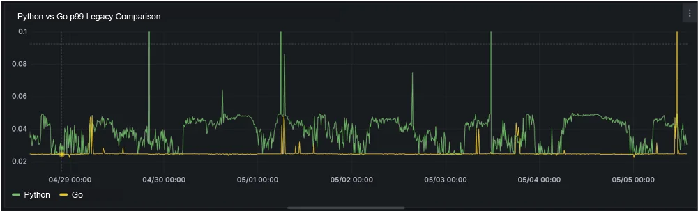

# How to Start Over: A Lesson in Rewriting Code

 

There comes a time in every project's lifecycle that is the proverbial tipping point. A moment when the code that has been written and the code that _needs_ to be written are just blatantly incompatible.

 

It's at this crossroad that a decision must be made: support even more tech debt and continue building a shaky house of cards, or **throw it all away and start over.**

 

The answer to that question is almost always, "More tech debt please!"

 

Deadlines, stakeholders, internal metrics, yada yada yada. Keep the project moving so that we can start on the next feature; we don't care how it's done.

 

The train keeps chugging along, and no one minds that the wheels are about to fall off. It's easy to ignore, but it is still very real and very broken. That's the tricky part of debt: it doesn't go away without paying it.

 

## Vue's Composition API

 

 

If you have ever been on the Vue docs page and are unfamiliar with the framework, you've probably been pretty confused by the toggle above. For a framework to present two different options to write the same code is pretty confusing, but it's a great example of when a rewrite _doesn't_ make sense.

 

Originally, Vue used Single File Components (SFC) that were on the "Options" API. At the time, that was just called "regular old Vue." As people started building more and more complex projects, they quickly ran into a problem with the way that Vue SFC. They were a mess.

 

Having logic split among different sections, hooks, and props is fine for smaller jobs. Once the complexity mounts, it is an organizational nightmare. So, did the maintainers of Vue rewrite everything? Nope. The solution was much more simple.

 

They released the "Composition" API, which is how Vue was building its components under the hood to begin with. You lose a bit of the syntactical sugar that comes from a higher-level approach, but you get much more control over organization and reactivity that was not there before.

 

No need to rewrite what was already there, just take something that _is_ working and let people run with it.

 
 

## A Comment-ary on Reddit

 

If you've never visited the [Reddit team's engineering blog](https://www.reddit.com/r/RedditEng/comments/1mbqto6/modernizing_reddits_comment_backend_infrastructure/), I highly recommend you check it out.

 

A recent write up of theirs was a total joy to read, all about how they rewrote some of their existing Python infrastructure in Go microservices. And the gods rejoiced.

 

 

 

Why move to Go instead of Python? It's what all the cool kids were doing. And...

 

Their team had the classic problem of scale. The legacy Python application was __working__, but it was clearly not optimal for the kind of traffic they have everyday. No matter how much power they put behind their legacy infrastructure, there was only so much that could be done.

 

This is an example of a great rewrite: there is nowhere to go, and your current solution is not cutting it.

 
 

## Your Rewrite Checklist

 

Okay, so to recap until now: rewrite all your code as Go microservices ✅

 

<small class="w-full block text-center">"You get a microservice, and YOU get a microservice, and..."</small>

 

Well, maybe not. You'll have to make that call yourself. 

 

So, __before__ you start that rewrite, take a moment and answer the following questions:

 

- Is the current solution _physically incapable_ of improving in the way that is required by the project's needs?
- Does someone on the team understand how it actually works, currently?
- Does the cost of fixing the old system outweigh the cost of rewriting it entirely?
- Are you willing to wait until it's entirely rewritten?

 

If you answered no to any of the questions above. Stop now, because only pain will await you.

 

### A Lesson in Pain

We recently had the idea to rewrite our main application "funnel" with a new architecture, and if we would have considered these questions, our answers would look like this:

 

- Yes. The current system cannot support what they want to do reasonably.
- Yes. I know how it works. Lucky me.
- Yes. Maintaining many variations over the years has made it impossible to maintain.
- __No.__ 

 

You can already see the writing on the wall in retrospect. Trying to fit a rewrite into a fixed amount of time while other teams are trying to make parallel changes becomes a nightmare.

 

The question is obvious then: "What would have been the right approach?"

 
 

## Consider the Strangler Fig

 

The wise Martin Fowler is the godfather of "refactoring" in the way we use it today. He had an analogy that I think is a perfect take on rewriting applications, which he dubbed ["The Strangler Fig" approach.](https://martinfowler.com/bliki/StranglerFigApplication.html)

 

The point he made was how this particular plant grows. First, it grabs onto and travels up an existing tree. Once at the top, it begins to overtake the existing limbs and branches, eventually replacing the tree's structure entirely with its own over time.

 

Killing it in the process, I might add. Nature is metal 🤘

 

He argues that the way to rewrite an application is not wholesale, but piecemeal--and I tend to agree with him.

 

Think back to the example of Reddit: would it have been a faster improvement to rewrite all of their existing, legacy code with Go? Sure. Would it have been safe? Hell no. Instead of replacing a whole system, they piece by piece restructured their code, with the goal of moving all core functionality off of their legacy app.

 

Looking back, we would have been much better off to replace smaller parts of our system first, then make the updates that were asked for. It's a much harder proposition to sell, but hey, developers get paid to make ideas come to life.

 
 

## In Closing

 

A rewrite is just like any other software project, and just because it's _technically necessary_ does not make it the correct __business decision.__

 

If you __do__ pass the checklist and decide on a rewrite, make sure to first take this approach:

 

- Break your problem down into individual services
- Rewrite those services with no dependencies, agreeing to a feature freeze
- Test thoroughly, using shadow requests in an opaque way to the users
- Refine, refactor, and deploy

 

 
 

Until next time, peace.
